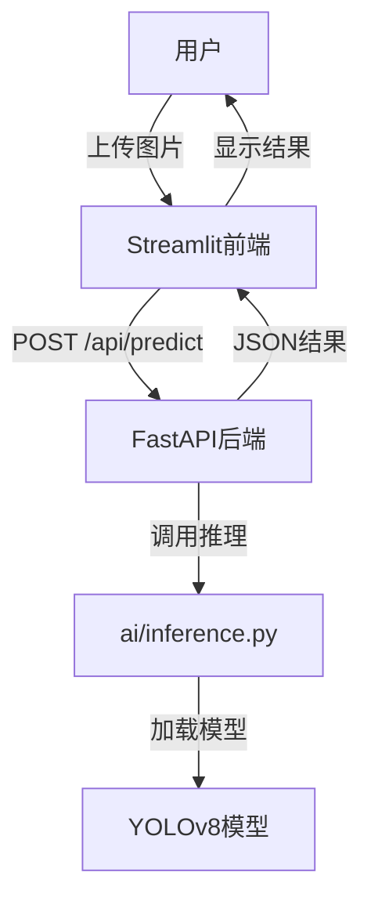

# 设计文档

## 概述

海洋垃圾检测系统采用前后端分离的架构，使用Streamlit作为前端界面，FastAPI作为后端API服务，YOLOv8作为AI推理引擎。系统允许用户上传海洋垃圾图片，通过训练好的深度学习模型进行目标检测，返回垃圾类别和置信度分数。

## 架构

### 系统架构图



### 技术栈

- **前端**: Streamlit (Python Web框架)
- **后端**: FastAPI (Python异步Web框架)
- **AI推理**: YOLOv8 (目标检测模型)
- **部署**: 
  - FastAPI: Render Free Web Service
  - Streamlit: Community Cloud

## 组件和接口

### 1. 前端组件 (app.py)

#### 主要功能
- 文件上传界面
- 进度条显示
- 结果展示和可视化
- 错误处理

#### 核心接口
```python
# Streamlit组件
st.file_uploader()  # 文件上传控件
st.progress()       # 进度条
st.bar_chart()      # 置信度条形图
st.image()          # 图片显示
```

#### API调用接口
```python
# 调用后端API
requests.post(
    url="http://backend-url/api/predict",
    files={"file": uploaded_file}
)
```

### 2. 后端组件 (main.py)

#### FastAPI应用结构
```python
from fastapi import FastAPI, File, UploadFile
from fastapi.middleware.cors import CORSMiddleware

app = FastAPI(title="Ocean Trash Detection API")

@app.post("/api/predict")
async def predict_trash(file: UploadFile = File(...))
```

#### 主要端点
- `POST /api/predict`: 接收图片文件，返回检测结果

### 3. AI推理模块 (ai/inference.py)

#### 核心功能
- YOLOv8模型加载和初始化
- 图片预处理
- 目标检测推理
- 结果后处理

#### 接口设计
```python
class TrashDetector:
    def __init__(self, model_path: str)
    def predict(self, image: np.ndarray) -> List[Detection]
    def load_model(self, model_path: str)
```

## 数据模型

### 1. 检测结果模型

```python
from pydantic import BaseModel
from typing import List

class Detection(BaseModel):
    class_name: str      # 垃圾类别名称
    confidence: float    # 置信度 (0-1)
    bbox: List[float]    # 边界框坐标 [x1, y1, x2, y2]

class PredictionResponse(BaseModel):
    success: bool
    detections: List[Detection]
    message: str = ""
    processing_time: float
```

### 2. 错误响应模型

```python
class ErrorResponse(BaseModel):
    success: bool = False
    error: str
    message: str
```

### 3. 支持的垃圾类别

基于海洋垃圾检测的常见类别：
- 塑料瓶 (plastic_bottle)
- 塑料袋 (plastic_bag)
- 罐头 (can)
- 纸张 (paper)
- 玻璃瓶 (glass_bottle)
- 其他垃圾 (other_trash)

## 错误处理

### 1. 前端错误处理

```python
# Streamlit错误处理策略
try:
    response = requests.post(api_url, files=files)
    if response.status_code == 200:
        # 处理成功响应
    else:
        st.error(f"API错误: {response.status_code}")
except requests.exceptions.ConnectionError:
    st.error("无法连接到后端服务")
except Exception as e:
    st.error(f"发生未知错误: {str(e)}")
```

### 2. 后端错误处理

```python
# FastAPI错误处理
from fastapi import HTTPException

@app.exception_handler(ValueError)
async def value_error_handler(request, exc):
    return JSONResponse(
        status_code=400,
        content={"success": False, "error": str(exc)}
    )

# 文件验证
def validate_image_file(file: UploadFile):
    if file.content_type not in ["image/jpeg", "image/png", "image/jpg"]:
        raise HTTPException(400, "不支持的文件格式")
    if file.size > 10 * 1024 * 1024:  # 10MB限制
        raise HTTPException(400, "文件大小超过限制")
```

### 3. AI推理错误处理

```python
# 推理模块错误处理
class InferenceError(Exception):
    pass

def safe_predict(self, image):
    try:
        results = self.model(image)
        return self.process_results(results)
    except Exception as e:
        raise InferenceError(f"推理失败: {str(e)}")
```

## 测试策略

### 1. 单元测试

#### 后端API测试
```python
# 使用pytest和httpx测试FastAPI
def test_predict_endpoint():
    with open("test_image.jpg", "rb") as f:
        response = client.post("/api/predict", files={"file": f})
    assert response.status_code == 200
    assert "detections" in response.json()
```

#### AI推理测试
```python
# 测试推理模块
def test_trash_detector():
    detector = TrashDetector("weights.pt")
    image = cv2.imread("test_trash.jpg")
    results = detector.predict(image)
    assert len(results) >= 0
    assert all(0 <= det.confidence <= 1 for det in results)
```

### 2. 集成测试

#### 端到端测试
```python
# 测试完整流程
def test_full_pipeline():
    # 1. 上传图片到API
    # 2. 验证返回结果格式
    # 3. 检查置信度范围
    # 4. 验证类别名称
```

### 3. 性能测试

#### 推理性能测试
- 单张图片推理时间 < 2秒
- 并发请求处理能力
- 内存使用监控

### 4. 用户界面测试

#### Streamlit界面测试
- 文件上传功能
- 进度条显示
- 结果可视化
- 错误消息显示

## 部署配置

### 1. FastAPI部署 (Render)

#### requirements.txt
```
fastapi==0.104.1
uvicorn==0.24.0
python-multipart==0.0.6
ultralytics==8.0.196
opencv-python-headless==4.8.1.78
numpy==1.24.3
pillow==10.0.1
```

#### render.yaml
```yaml
services:
  - type: web
    name: ocean-trash-api
    env: python
    buildCommand: pip install -r requirements.txt
    startCommand: uvicorn main:app --host 0.0.0.0 --port $PORT
```

### 2. Streamlit部署 (Community Cloud)

#### requirements.txt
```
streamlit==1.28.1
requests==2.31.0
pillow==10.0.1
plotly==5.17.0
```

#### .streamlit/config.toml
```toml
[server]
maxUploadSize = 10

[theme]
primaryColor = "#1f77b4"
backgroundColor = "#ffffff"
secondaryBackgroundColor = "#f0f2f6"
```

### 3. 环境变量配置

```python
# 配置管理
import os
from pydantic import BaseSettings

class Settings(BaseSettings):
    model_path: str = "weights.pt"
    max_file_size: int = 10 * 1024 * 1024
    api_base_url: str = os.getenv("API_BASE_URL", "http://localhost:8000")
    
    class Config:
        env_file = ".env"
```

## 安全考虑

### 1. 文件上传安全
- 文件类型验证
- 文件大小限制
- 文件内容扫描

### 2. API安全
- CORS配置
- 请求频率限制
- 输入验证

### 3. 模型安全
- 模型文件完整性检查
- 推理结果验证
- 异常输入处理